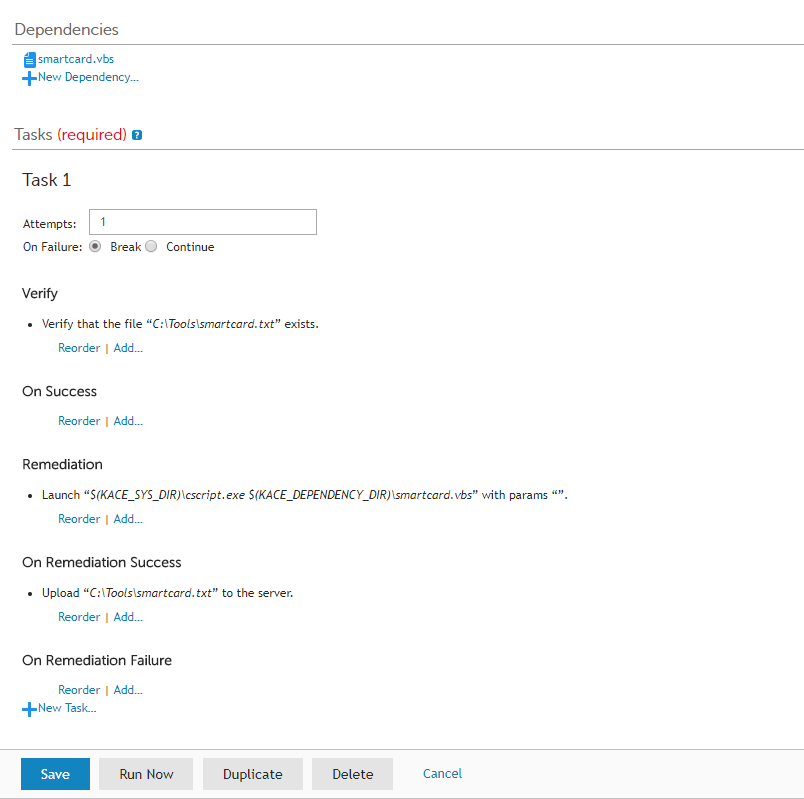
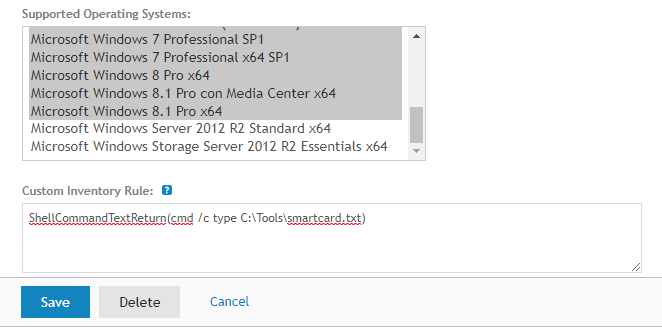

# Target
Find and report all managed Windows PCs in K1000 Inventory with a smartcard reader installed.

## Overview
The script does not depend by K1000, so if you don't have KACE SMA in your environment don't worry: the script is still useful!

## Components
* [The Query] This script :innocent:
* [The Automation] Kace Systems Management Appliance (AKA 'K1000')


# How it works
1. The vbs script executes a WMI query over the target device(s) and saves an output file named _smartcard.txt_ (see below in the [Setup section](#setup))
2. The vbs script is scheduled and deployed to the target device(s) via K1000 [_Online KScript_](#the-kscript)
3. A K1000 [_Custom Inventory Rule_](#the-custom-inventory-rule) reads the output file for every inventoried device and stores the information in the database
4. A scheduled Report (choose your favorite format between HTML, CSV, PDF or Excel) returns only PCs with a smart card reader installed
5. Done!

## Setup

### The KScript
1. Edit [the script](smartcard.vbs) **line 4** with the path where you want to save the output file. In our environment every PC has a _"C:\Tools"_ directory for service purpose, so i decided to save the output there.

```vbs
Set f = log.CreateTextFile("C:\Tools\smartcard.txt", 2)
```
2. Go to your _K1000 Dashboard_, then go to _Scripting_ and create a **New Script** (_Choose Action / New_)

3. Name the script as your wish (for example: Check Smart Card Reader) and follow these steps:

#### Script Basic Settings
* Type: **Online KScript**
* Enabled: **Yes**
* Deploy: one or some devices, all devices or to a Device Label, according to your needs in your environment
* Windows Run As: **Local System**
* Upload the smartcard.vbs as **New Dependecy**

#### Tasks
We want the script to run once in every PC, so we'll use a "checkmark" (the smartcard.txt) to verify that...

* Verify: **Verify a file exists...**
    * C:\Tools\smartcard.txt
* Remediation: **Launch a program...**
    * Directory: **$(KACE_SYS_DIR)**
    * File: **cscript.exe $(KACE_DEPENDENCY_DIR)\smartcard.vbs**
    * Wait for completion: **Yes**
* On Remediation Success: **Upload a file...** (note: this step is not necessary and only for archiving purpose)
    * Directory: **C:\Tools**
    * File: **smartcard.txt**

...and **Save** your brand new script.

The Task and its steps are summarized in the following image. When you're ready, let's jump to the [Step 4!](#the-custom-inventory-rule)



### The Custom Inventory Rule

1. In the K100 Dashboard, now go to _Inventory_, then go to _Software_  and create a **new Software entry** (_Choose Action / New_)

2. Name the rule as your wish (for example: IT Dep - Check Smart Card Reader) and follow these steps:

* Publisher: **IT Department** (it's useful for further searches into the _Software Inventory_)
* Supported Operating Systems: **All the Windows OSs in your Inventory**
* Custom Inventory Rule: `ShellCommandTextReturn(cmd /c type C:\Tools\smartcard.txt)`

and **Save** your new Custom Inventory Rule

